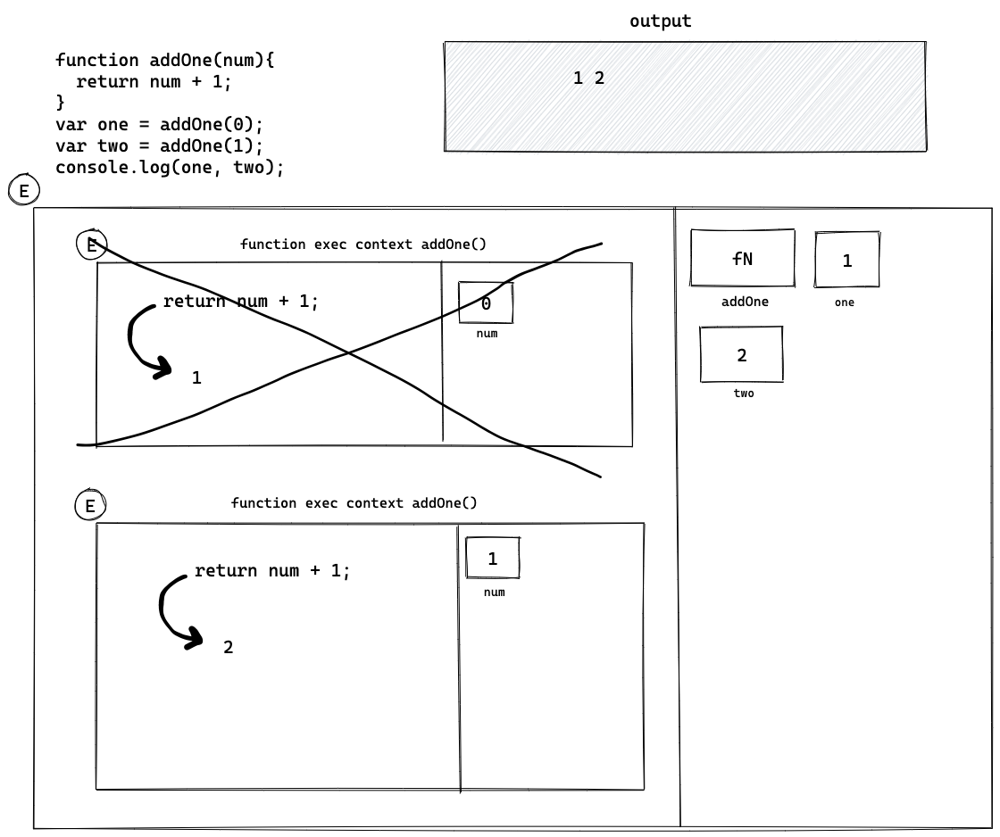
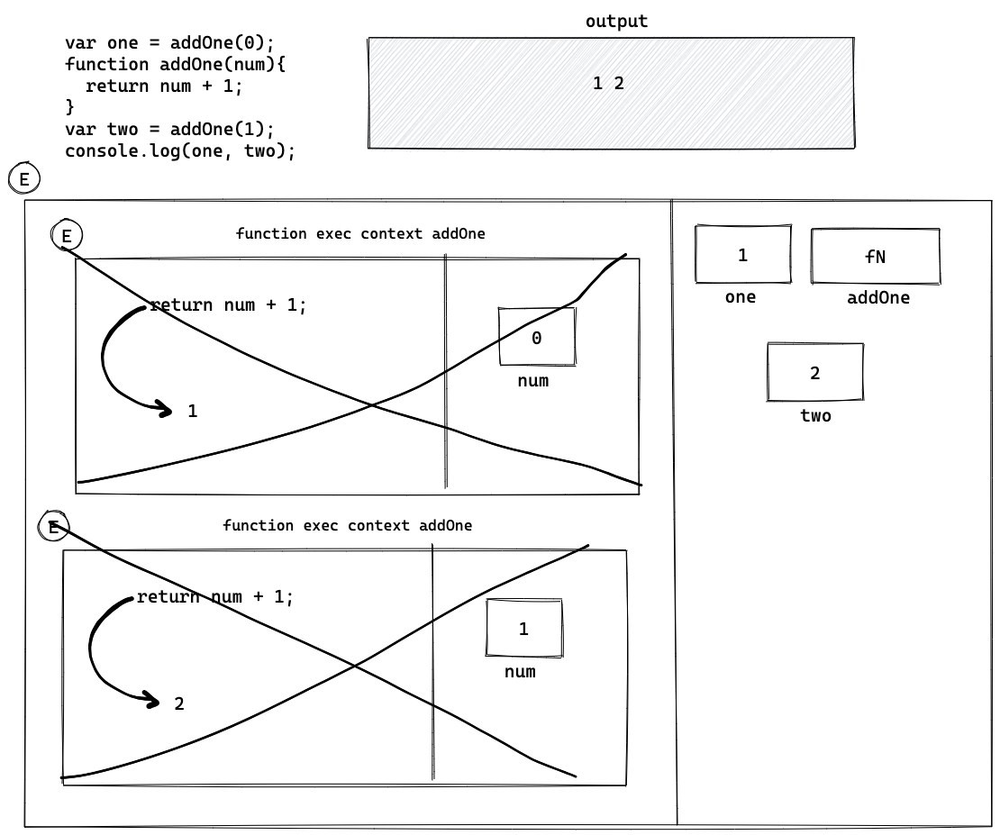
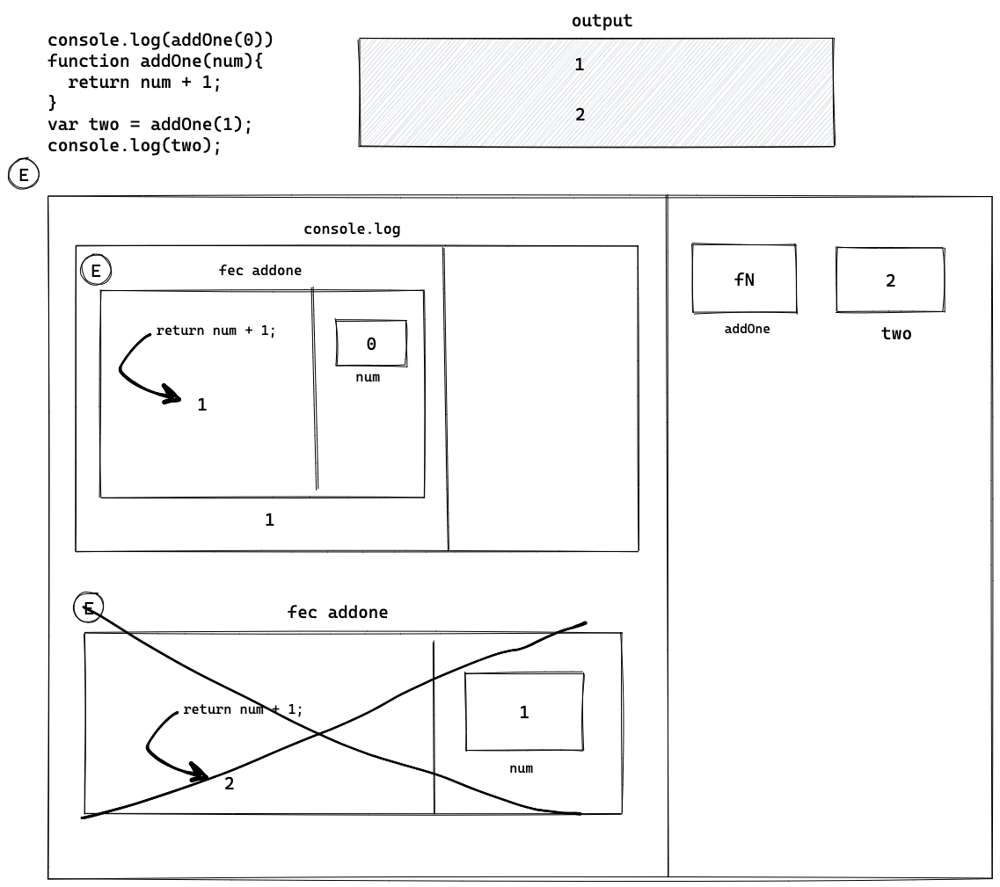

## Understanding Scope and the difference between var, let and const

Watch this video before doing the exercise: https://www.youtube.com/watch?v=XgSjoHgy3Rk

1. Guess the output:

```js
let firstName = 'Arya';
const lastName = 'Stark';
var knownAs = 'no one';

console.log(
  window.firstName,  // Arya
  window.lastName, // un
  window.knownAs // no one
);
```

2. Guess the output:

```js
let firstName = 'Arya';
const lastName = 'Stark';
var knownAs = 'no one';

function fullName(a, b) {
  return a + b;
}

console.log(window.fullName(firstName, lastName)); // AryaStark
```

3. Make a Execution Context Diagram for the following JS and write the output.

```js
function addOne(num){
  return num + 1;
}
var one = addOne(0);
var two = addOne(1);
console.log(one, two); // 1 2



```

4. Make a Execution Context Diagram for the following JS and write the output.

```js
var one = addOne(0);
function addOne(num){
  return num + 1;
}
var two = addOne(1);
console.log(one, two); // 1 2



```

5. Make a Execution Context Diagram for the following JS and write the output.

```js
console.log(addOne(0)); // 1
function addOne(num){
  return num + 1;
}
var two = addOne(1);
console.log(two); // 2



```

6. Make a Execution Context Diagram for the following JS and write the output.

```js
var one = addOne(0);
const addOne = (num) => {
  return num + 1;
};
var two = addOne(1);
console.log(two); // ?????
```

7. Make a Execution Context Diagram for the following JS and write the output.

```js
console.log(addOne(0)); // ?????
const addOne = (num) => {
  return num + 1;
};
var two = addOne(1);
console.log(two); // ?????
```

8. What will be the output of the following

```js
function isAwesome() {
  var awesome;
  if (false) {
    awesome = true;
  }
  console.log(awesome);
}
isAwesome(); // undefined
```

9. What will be the output of the following

```js
function isAwesome() {
  let awesome;
  if (true) {
    awesome = true;
  }
  console.log(awesome);
}
isAwesome(); // true 
```

10. What will be the output of the following

```js
function isAwesome() {
  let awesome;
  if (false) {
    awesome = true;
  }
  console.log(awesome);
}
isAwesome(); // undefined
```

11. What will be the output of the following

```js
let firstName = 'Arya';
const lastName = 'Stark';
var knownAs = 'no one';

function fullName(a, b) {
  return a + b;
}
const name = fullName(firstName, lastName);
console.log(name); // AryaStark
```

12. Guess the output of the code below with a reason.

```js
function sayHello() {
  let name = 'Arya Stark';
}
sayHello();

console.log(name); // undefined

// Let is block-scoped so 'name' is not accessible beyond the function within which it is defined.
```

13. Guess the output of the code below with a reason.

```js
if (true) {
  var name = 'Arya Stark';
}
console.log(name); // Arya Stark

//Var is function scoped, so it's accessible outside the function as well.
```

14. Guess the output of the code below with a reason.

```js
if (true) {
  let name = 'Arya Stark';
}
console.log(name); // reference error

// let is block scoped and doesn't allow for the variable to be accessed outside the function definition.
```

15. Guess the output of the code below with a reason.

```js
for (var i = 0; i < 20; i++) {
  //
}
console.log(i); // 20

//Var is function scoped and is accessible outside the function definition as well.
```

16. Guess the output of the code below with a reason.

```js
for (let i = 0; i < 20; i++) {
  //
}
console.log(i); // reference error: i is not defined

// let is block scoped and therefore can't be accessed outside the function.
```

17. Guess the output and the reason behind that.

```js
function sample() {
  if (true) {
    var username = 'John Snow';
  }
  console.log(username);
}
sample(); // John Snow

//Var is function scoped and can therefore be accessed outside the immediate function definition.
```

18. Guess the output and the reason behind that.

```js
function sample() {
  if (true) {
    let username = 'John Snow';
  }
  console.log(username);
}
sample(); // reference error

//Let is block scoped so no scene.
```

19. Guess the output and the reason behind that.

```js
function sample() {
  var username = 'Arya Stark';
  if (true) {
    var username = 'John Snow';
    console.log(username);
  }
  console.log(username, 'second');
}
sample(); // John Snow
//           John Snow second

// Var is function scoped, which enables it to be accesible everywhere.
```

20. Guess the output and the reason behind that.

```js
function sample() {
  let username = 'Arya Stark';
  if (true) {
    let username = 'John Snow';
    console.log(username, 'first');
  }
  console.log(username, 'second');
}
sample(); // John Snow first
          // Arya Stark second
```

21. Guess the output and the reason behind that.

```js
function sample(...args) {
  for (let i = 0; i < args.length; i++) {
    let message = `Hello I am ${args[i]}`;
    console.log(message);
  }
}

sample('First', 'Second', 'Third');
// `Hello I am First`
// `Hello I am Second`
// `Hello I am Third`

//Let is block scoped and the console.log function is called within the block, so all is well.
```

22. Guess the output and the reason behind that.

```js
function sample(...args) {
  for (let i = 0; i < args.length; i++) {
    const message = `Hello I am ${args[i]}`;
    console.log(message);
  }
}

sample('First', 'Second', 'Third');
// `Hello I am First`
// `Hello I am Second`
// `Hello I am Third`

//Const is block scoped and the console.log function is called within the block, so all is well.
```

23. Guess the output and the reason behind that.

```js
if (true) {
  const myFunc = function () {
    console.log(username, 'Second');
  };
  console.log(username, 'First');
  let username = 'Hello World!';
  myFunc(); // reference error
}

// Let doesn't initialize during the definition phase, hence cannot be accessed before that.
```

24. Guess the output and the reason behind that.

```js
function outer() {
  let movie = 'Mad Max: Fury Road';
  function inner() {
    console.log(
      `I love this movie called ${movie.toUpperCase()}`
    );
  }
  inner();
}

outer(); // I love this movie called MAD MAX: FURY ROAD.
```

25. Guess the output and the reason behind that.

```js
function outer() {
  let movie = 'Mad Max: Fury Road';
  function inner() {
    let movie = 'Before Sunrise';
    console.log(
      `I love this movie called ${movie.toUpperCase()}`
    );
  }
  inner();
}

outer(); // I love this movie called BEFORE SUNRISE
```

26. Guess the output and the reason behind that.

```js
function outer() {
  let movie = 'Mad Max: Fury Road';
  function inner() {
    let movie = 'Before Sunrise';
    function extraInner() {
      let movie = 'Gone Girl';
      console.log(
        `I love this movie called ${movie.toUpperCase()}`
      );
    }
    extraInner();
  }
  inner();
}
outer(); // I love this movie called GONE GIRL
```

27. Using reduce find the final value when the initial value passed is `100`. You have to pass the output of one function into the input of next function in the array `allFunctions` starts with `addOne` ends with `half`.

```js
const addOne = (num) => {
  return num + 1;
};
const subTwo = (num) => {
  return num - 2;
};
const multiplyThree = (num) => {
  return num * 3;
};
const half = (num) => {
  return num / 2;
};

let allFunctions = [
  addOne,
  subTwo,
  multiplyThree,
  addOne,
  multiplyThree,
  half,
];

allFunctions.reduce((acc, cv) => {
  acc = cv[acc];
  return acc;
}, 100)

// Answer is: 447
```
